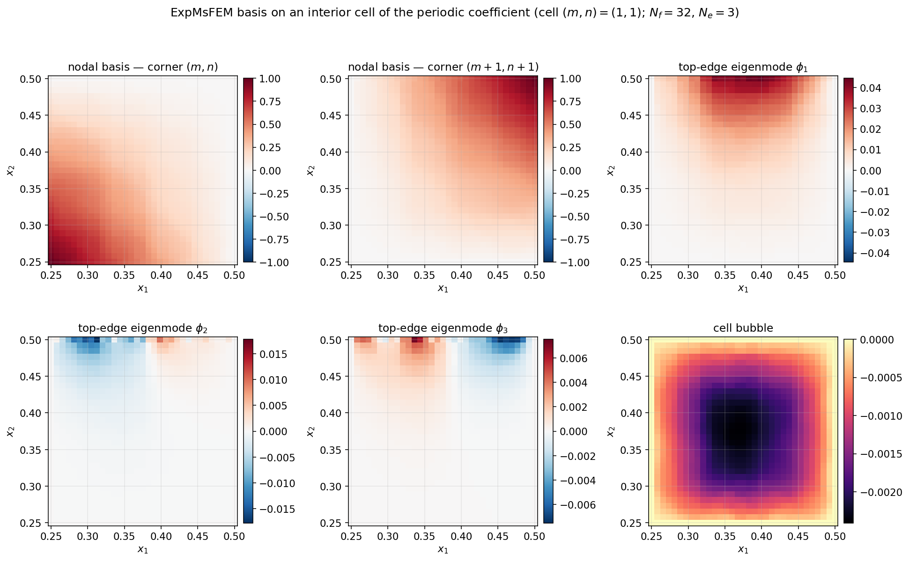
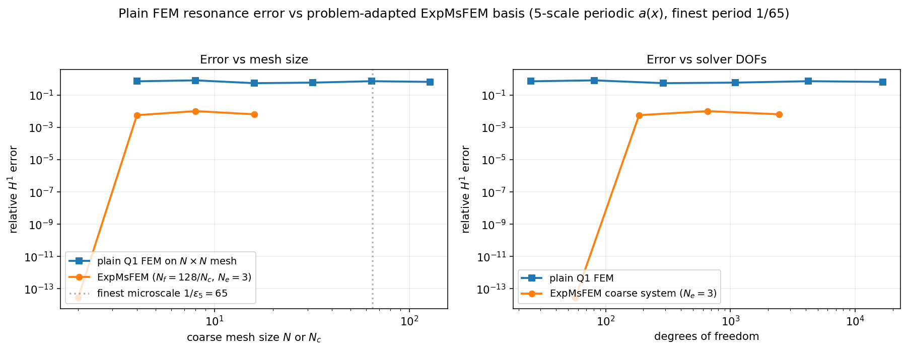
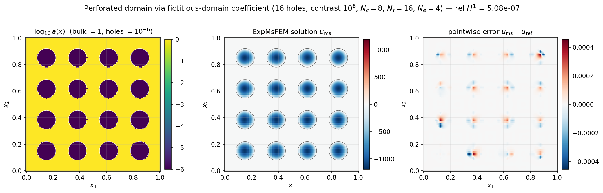
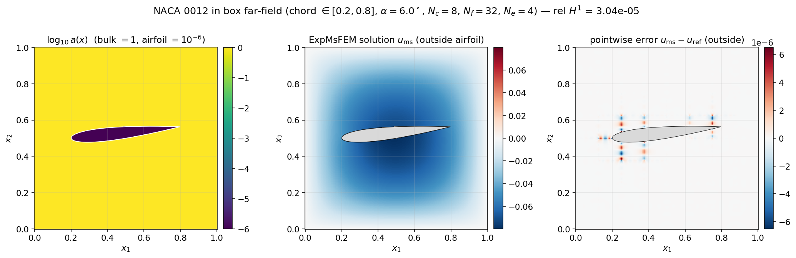
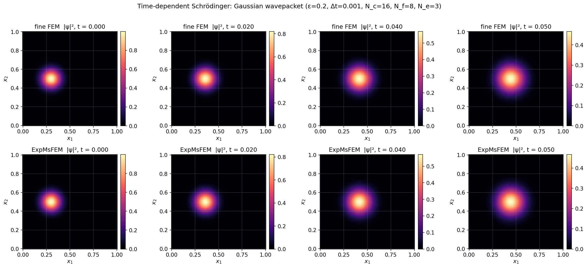

# ExponentialMsFEM

Exponentially convergent multiscale finite element methods (ExpMsFEM) for 2D elliptic and Helmholtz problems on uniform rectangular meshes.

The default implementation on `main` is **Python/JAX**. A parallel Julia implementation lives on the [`julia-code`](https://github.com/yifanc96/ExponentialMsFEM/tree/julia-code) branch.


## What's in here

- **`expmsfem/`** — the Python package. Elliptic and Helmholtz ExpMsFEM plus the `H+bubble` / `O(H)` MsFEM baselines.
- **`tests/`** — 61 unit + convergence tests covering primitives, local operators, assembly, and end-to-end convergence.
- **`examples/`** — scripts mirroring the [Matlab](https://github.com/RoyWangyx/Exponentially-convergent-multiscale-finite-elements.git) `main.m` drivers for periodic / random / high-contrast elliptic and for the Helmholtz case.
- **`demos/`** — six standalone figure-generating demos. Re-run with `python demos/run_all.py`.
- **`figures/`** — gallery of pre-generated PNGs used below.

The companion Julia implementation (FEM, classical MsFEM, and ExpMsFEM for both elliptic and Helmholtz) lives on the [`julia-code`](https://github.com/yifanc96/ExponentialMsFEM/tree/julia-code) branch.

## Quickstart

```bash
git clone https://github.com/yifanc96/ExponentialMsFEM.git
cd ExponentialMsFEM
python3 -m venv .venv
.venv/bin/pip install -e '.[dev]'
.venv/bin/python -m pytest            # 61 passed in ~45s
.venv/bin/python demos/run_all.py     # regenerate the figure gallery
```

## Minimal example

```python
from expmsfem.coefficients import afun_periodic
from expmsfem.driver import run_expmsfem

# 8x8 coarse cells, 16x16 fine per coarse cell, 4 edge eigenmodes per edge
out = run_expmsfem(afun_periodic, N_c=8, N_f=16, N_e=4, n_workers=4)
print(f"relative L2 = {out['e_L2']:.2e}")
print(f"relative H1 = {out['e_H1']:.2e}")
u_fine = out["u_ms_fine"]   # length (N_c*N_f + 1)**2 reconstructed solution
```

For the Helmholtz impedance problem:

```python
from expmsfem.helmholtz.driver import run_expmsfem_helm
out = run_expmsfem_helm(N_c=8, N_f=8, N_e=5, k0=2.0, n_workers=4)
```

For the `H+bubble` / `O(H)` baseline methods:

```python
from expmsfem.baselines import run_hbubble, run_OH
```

## Demonstrations

### 1. Coefficient fields

The three elliptic coefficient variants that ship with the package.


### 2. Exponential convergence

Relative H¹ and L² error against the fine-FEM reference as `N_e` grows. The straight lines on a semilogy axis are the signature of exponential convergence in the number of edge modes per interior edge.


### 3. Solution reconstruction

Fine-FEM reference vs ExpMsFEM reconstruction on the periodic coefficient, with the pointwise error field on the right. At `N_c=8`, `N_f=32`, `N_e=5` the reconstruction matches the reference to ~`1e-6`.


### 4. Method comparison: Exp vs H+bubble vs O(H)

Three multiscale methods, all using the same coarse mesh and all solving the same elliptic problem:

| Method       | Per-cell basis                                          | What's captured                                  |
|--------------|---------------------------------------------------------|--------------------------------------------------|
| **Exp**      | 4 nodal hats + `N_e` edge eigen-modes **+ 1 edge bubble** per edge **+ 1 cell bubble**  | harmonic (edge) + bubble (interior); exponential-in-`N_e` convergence |
| **H+bubble** | 4 nodal hats + `N_e` edge eigen-modes + 1 cell bubble (no edge bubble)     | harmonic edges with the bubble glued on; algebraic rate |
| **O(H)**     | 4 nodal hats + `N_e` edge eigen-modes only                              | harmonic edges alone; can't resolve the RHS-driven interior — stalls at `O(H)` |

The "cell bubble" is the particular solution of `−∇·(a∇u) = f` on one cell with zero perimeter data; the "edge bubble" is the trace of the analogous oversampled-patch bubble extended back into each cell. Both are RHS-driven basis functions — they live in the **bubble subspace** of the harmonic-bubble decomposition.


Only Exp's error drops exponentially with `N_e`; H+bubble improves algebraically, O(H) stalls near its initial value.

### 5. Eigenvalue decay — the *why*

The per-edge generalised eigenproblem `R^T N R v = λ P v` has eigenvalues that decay geometrically. Keeping the top `N_e` eigenvectors captures all but an `exp(−α N_e)` fraction of the edge-trace space — this is the theoretical source of the method's exponential rate.


### 6. Helmholtz impedance problem

Real and imaginary parts of the multiscale solution on the case-1 Helmholtz problem (constant `a=v=1`, plane-wave impedance data, wavenumber `k₀=2`) plus the pointwise error vs fine-FEM. At `N_c=N_f=8`, `N_e=5` the relative H¹ error is 6.4e-8.


### 7. What the basis actually looks like

Six panels on a single interior coarse cell for the 5-scale periodic coefficient: two nodal-hat basis functions (Q1-harmonic, visibly adapted to the local `a(x)` rather than piecewise-linear), the top three edge eigen-modes on one shared edge (ranked by `(R^T N R, P)` eigenvalue — note how they become more oscillatory), and the per-cell bubble (Dirichlet-0 solve with constant RHS).



### 8. Why multiscale beats plain FEM on rough coefficients

The 5-scale periodic `a(x)` has its finest oscillation period at `1/65`. A plain Q1 FEM on an `N × N` grid can't see anything below its own mesh, so for `N < 65` the solution has an O(1) resonance error that does **not** shrink with refinement. ExpMsFEM on the same coarse grid builds a problem-adapted basis from fine-scale local solves — at every mesh size it beats plain FEM by three to thirteen orders of magnitude in H¹.



> **Note on the ExpMsFEM curve.** The sweep keeps `N_c · N_f = 128` fixed (so the underlying fine resolution is constant) and varies the `(N_c, N_f)` trade-off at fixed `N_e = 3`. Small `N_c` means large fine sub-cells: each cell's nodal + edge basis almost spans the full fine-scale solution there, so the error is dominated by the edge stitching between only a few cells — which `N_e = 3` handles essentially to machine precision. Larger `N_c` means smaller fine sub-cells and many more edges to stitch; at `N_e = 3` a larger fraction of the edge information is discarded and the error rises. The clean exponential-in-`N_e` picture at fixed `N_c` is what the *Exponential convergence* panel above shows.

### 9. Perforated / complicated domains (fictitious-domain coefficient)

Geometric complexity enters the method through `a(x)` — we don't need to change the rectangular background mesh. Set `a = 1` in the bulk and `a = 10^{-6}` inside each hole; as the contrast grows, the holes become approximate Dirichlet-zero regions and the configuration converges to the classical perforated-domain problem. The edge eigen-basis automatically adapts to the high-contrast jumps at every hole boundary, so ExpMsFEM stays well-conditioned and low-DOF.

The demo uses 16 circular holes on a 4×4 lattice with `10^6`× contrast; `N_c = 8`, `N_f = 16`, `N_e = 4` gives relative H¹ error ~`5e-7` vs the fine-FEM reference.



```python
from expmsfem.coefficients import afun_perforated, default_hole_lattice
from expmsfem.driver import run_expmsfem

centers = default_hole_lattice(n_per_side=4, margin=0.15)
a = afun_perforated(centers, hole_radius=0.07, a_out=1.0, a_in=1e-6)
out = run_expmsfem(a, N_c=8, N_f=16, N_e=4, n_workers=4)
```

### 10. CFD-adjacent: NACA 0012 airfoil in a box far-field

The same fictitious-domain trick scales up to a geometrically non-trivial CFD-style obstacle — a NACA 0012 airfoil at a prescribed angle of attack embedded inside the `[0, 1]²` box. The airfoil's sharp trailing edge and sqrt-singular leading edge are resolved purely through the coefficient jump — no mesh conforming, no cut cells. `N_c = 8`, `N_f = 32`, `N_e = 4` with `10^6`× contrast gives relative H¹ error ~`3e-5` vs a fine-FEM reference (and the airfoil interior is masked in the plot because `u_inside ∝ 1/a_in` is a fictitious-domain artifact, not the physical quantity of interest).



```python
from expmsfem.coefficients import afun_naca0012
from expmsfem.driver import run_expmsfem

a = afun_naca0012(chord_start=0.2, chord_end=0.8, y_center=0.5,
                  thickness=0.12, alpha_deg=6.0,
                  a_out=1.0, a_in=1e-6)
out = run_expmsfem(a, N_c=8, N_f=32, N_e=4, n_workers=4)
```

The problem here is the scalar elliptic `-∇·(a ∇u) = f` with homogeneous Dirichlet on the box — **not** incompressible Navier–Stokes — but the geometric complexity and the adapted-basis story carry over to any PDE whose weak form is handled elementwise on a rectangular background mesh.

### 11. Time-dependent Schrödinger (semi-classical, backward Euler)

The semi-classical Schrödinger equation on `Ω = (0, 1)²`

`i ε ∂_t ψ = −½ ε² Δ ψ + V(x) ψ, ψ|_∂Ω = 0`

is discretised in time by backward Euler; each step is a linear complex-indefinite elliptic solve,

`( −½ ε² Δ + V − iε/Δt ) · ψ_{n+1} = −iε/Δt · ψ_n`,

which fits the classical ExpMsFEM framework exactly. The complex-symmetric shifted operator plays the role of the cell stiffness; the harmonic-bubble decomposition of the coarse-basis vs cell-bubble parts decouples the Galerkin problem. The offline phase (per-cell UMFPACK factors, edge eigen-basis) is built **once** when `Δt` is held fixed — every time step is then a cheap online coarse solve plus per-cell bubble correction.

The demo below shows a Gaussian wavepacket propagating with `ε = 0.2`, `Δt = 10⁻³` over 50 steps. Top row: fine-FEM reference `|ψ|²`. Bottom row: ExpMsFEM reconstruction `|ψ|²` on `N_c = 16, N_f = 8, N_e = 3`. Relative L² error stays `~2·10⁻⁴` across the whole run.



```python
import numpy as np
from expmsfem.schrodinger.time_dep import SemiclassicalParam, run_expmsfem_schrodinger

eps, dt = 0.2, 1e-3
V = lambda x, y: np.zeros_like(np.asarray(x) * np.asarray(y))
N_c, N_f = 16, 8
xs = np.linspace(0, 1, N_c * N_f + 1)
X, Y = np.meshgrid(xs, xs, indexing="xy")
psi0 = (np.exp(-((X - 0.3)**2 + (Y - 0.5)**2) / (2 * 0.1**2))
        * np.exp(1j * 3.0 * X / eps)).ravel()

param = SemiclassicalParam(eps=eps, V_fun=V, dt=dt)
ts, frames, prop = run_expmsfem_schrodinger(
    param, psi0, N_c, N_f, N_e=3, n_steps=50, save_stride=10, n_workers=4,
)
# frames[:, i] is ψ at time ts[i] on the (N_c·N_f + 1)² fine grid
```

## Features

| Problem                                      | Module                                  |
|----------------------------------------------|-----------------------------------------|
| Elliptic, periodic coefficient               | `expmsfem.driver.run_expmsfem`          |
| Elliptic, random rough coefficient           | `afun_random` + `run_expmsfem`          |
| Elliptic, high-contrast channel coefficient  | `afun_highcontrast` + `run_expmsfem`    |
| Elliptic, perforated (fictitious-domain)     | `afun_perforated` + `run_expmsfem`      |
| Elliptic, NACA 0012 airfoil in box far-field | `afun_naca0012` + `run_expmsfem`        |
| Helmholtz impedance (complex, indefinite)    | `expmsfem.helmholtz.driver.run_expmsfem_helm` |
| Time-dependent Schrödinger (backward Euler)  | `expmsfem.schrodinger.time_dep.run_expmsfem_schrodinger` |
| Baselines: `H+bubble`, `O(H)`                | `expmsfem.baselines`                    |

### Harmonic-bubble decomposition — the organising principle

Every basis in this package is organised around one decomposition: on each coarse cell any fine-scale function `u` splits uniquely as

`u = u_harm + u_bub`, with `u_harm` discrete-harmonic (satisfies `A u = 0` on interior DOFs, with given perimeter data) and `u_bub` a bubble (zero on the perimeter).

For complex-symmetric `A` — elliptic, Helmholtz, or the Schrödinger shifted operator — the two pieces are **A-orthogonal** in the transpose pairing `u^T A v = 0`. The consequence:

- **Harmonic subspace** ≈ 4 nodal hats + `N_e` edge eigen-modes per edge. The edges are where the eigen-truncation gives exponential convergence.
- **Bubble subspace** ≈ 1 edge bubble per edge + 1 cell bubble (RHS-driven particular solutions). For a homogeneous problem these collapse to zero; for a driven one they carry the entire forcing.
- **Online Galerkin** decouples: the coarse harmonic coefficients solve `A_coarse · c = (value^T · f)`, and the bubble is read off separately per cell.

Every variant below instantiates this skeleton with a different operator `A`.

### Implementation highlights

- **Parallel offline**: `Workspace.prefactor_all()` factorises every cell and every interior-edge patch in a thread pool (embarrassingly parallel, 3–4× speedup measured).
- **Partial eigensolves**: per-edge generalised eigenproblem solved with `scipy.linalg.eigh(subset_by_index=...)`, keeping only the top `N_e` modes.
- **Edge-data cache**: per-interior-edge `(L₁RV, L₂RV, L₁·bub, L₂·bub)` computed once and shared by both adjacent cells.
- **Complex variant**: Helmholtz uses the sesquilinear Matlab convention `K = value.T · B · conj(value)` with the transpose solve `A.T \ F`; both UMFPACK factors of `A_ii` and `A_ii.T` are cached so online solves are fast.
- **Time-dependent Schrödinger** reuses the same skeleton with the complex-symmetric shifted operator `−½ε²Δ + V − iε/Δt`; when `Δt` is held fixed, the offline factor is built once and every time step is an O(coarse-DOFs) back-substitution.

## Validation

The `tests/` directory includes convergence tests for every variant (periodic / random / high-contrast / Helmholtz) that assert monotone exponential H¹ decay on a tiny problem. Full-size numbers from running the examples:

| Problem                                | `N_c` | `N_f` | H¹ at `N_e=1`   | H¹ at `N_e=5`   |
|----------------------------------------|:-----:|:-----:|:----------------:|:----------------:|
| Elliptic, periodic                     | 8     | 16    | 7.1e-2          | 3.3e-4          |
| Elliptic, random                       | 8     | 16    | 4.4e-2          | 4.1e-4          |
| Elliptic, high-contrast 64×            | 8     | 16    | 2.7e-2          | 2.8e-5          |
| Helmholtz impedance, `k₀=2`           | 8     | 8     | 6.1e-4          | 6.2e-8          |

## Relevant papers

1. Yifan Chen, Thomas Y. Hou, Yixuan Wang. "[Exponential Convergence for Multiscale Linear Elliptic PDEs via Adaptive Edge Basis Functions](https://arxiv.org/abs/2007.07418)", SIAM Multiscale Modeling and Simulation, 2021.
```
@article{chen2021exponential,
  title={Exponential convergence for multiscale linear elliptic PDEs via adaptive edge basis functions},
  author={Chen, Yifan and Hou, Thomas Y and Wang, Yixuan},
  journal={Multiscale Modeling \& Simulation},
  volume={19},
  number={2},
  pages={980--1010},
  year={2021},
  publisher={SIAM}
}
```


2. Yifan Chen, Thomas Y. Hou, Yixuan Wang. "[Exponentially convergent multiscale methods for high frequency heterogeneous Helmholtz equations](https://arxiv.org/abs/2105.04080)", SIAM Multiscale Modeling and Simulation, 2023.
```
@article{chen2023exponentially,
  title={Exponentially convergent multiscale methods for 2d high frequency heterogeneous Helmholtz equations},
  author={Chen, Yifan and Hou, Thomas Y and Wang, Yixuan},
  journal={Multiscale Modeling \& Simulation},
  volume={21},
  number={3},
  pages={849--883},
  year={2023},
  publisher={SIAM}
}
```
3. Yifan Chen, Thomas Y. Hou, and Yixuan Wang. "[Exponentially convergent multiscale finite element method](https://link.springer.com/article/10.1007/s42967-023-00260-2)". Communications on Applied Mathematics and Computation, 2024.
```
@article{chen2024exponentially,
  title={Exponentially convergent multiscale finite element method},
  author={Chen, Yifan and Hou, Thomas Y and Wang, Yixuan},
  journal={Communications on Applied Mathematics and Computation},
  volume={6},
  number={2},
  pages={862--878},
  year={2024},
  publisher={Springer}
}
```
