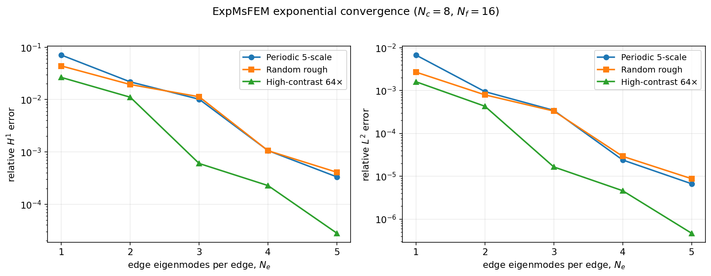
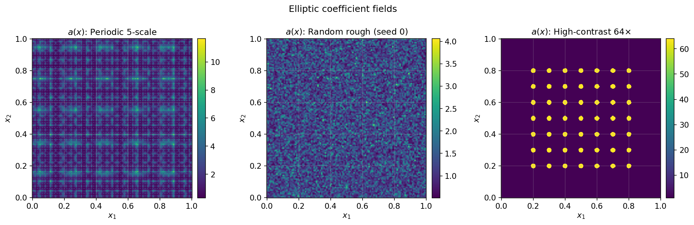
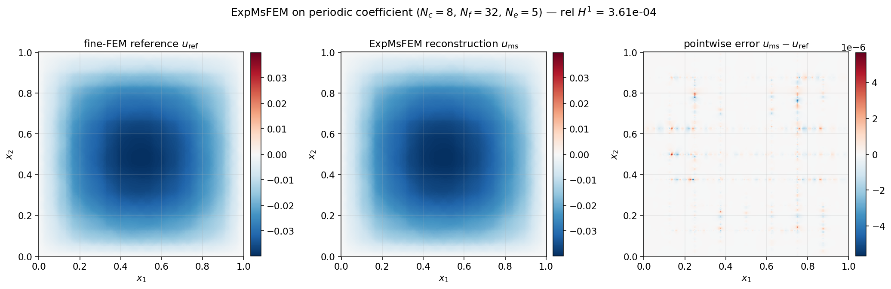
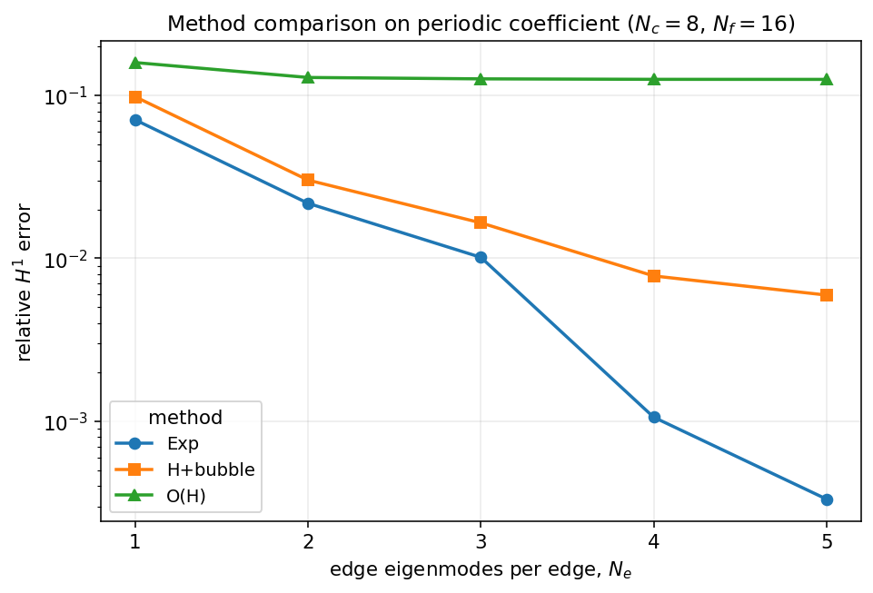
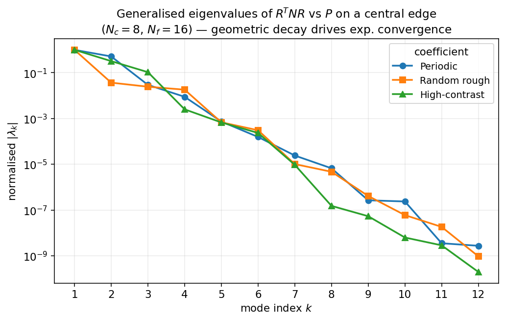
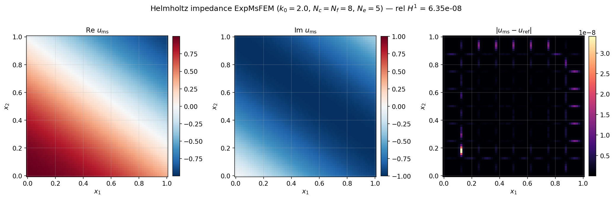

# ExponentialMsFEM

Exponentially convergent multiscale finite element methods (ExpMsFEM) for 2D elliptic and Helmholtz problems on uniform rectangular meshes.

The default implementation on `main` is **Python/JAX**. A parallel Julia implementation lives on the [`julia-code`](https://github.com/yifanc96/ExponentialMsFEM/tree/julia-code) branch.



## What's in here

- **`expmsfem/`** — the Python package. Elliptic and Helmholtz ExpMsFEM plus the `H+bubble` / `O(H)` MsFEM baselines.
- **`tests/`** — 61 unit + convergence tests covering primitives, local operators, assembly, and end-to-end convergence.
- **`examples/`** — scripts mirroring the Matlab `main.m` drivers for periodic / random / high-contrast elliptic and for the Helmholtz case.
- **`demos/`** — six standalone figure-generating demos. Re-run with `python demos/run_all.py`.
- **`figures/`** — gallery of pre-generated PNGs used below.

The companion Julia implementation (FEM, classical MsFEM, and ExpMsFEM for both elliptic and Helmholtz) lives on the [`julia-code`](https://github.com/yifanc96/ExponentialMsFEM/tree/julia-code) branch.

## Quickstart

```bash
git clone https://github.com/yifanc96/ExponentialMsFEM.git
cd ExponentialMsFEM
python3 -m venv .venv
.venv/bin/pip install -e '.[dev]'
.venv/bin/python -m pytest            # 61 passed in ~45s
.venv/bin/python demos/run_all.py     # regenerate the figure gallery
```

## Minimal example

```python
from expmsfem.coefficients import afun_periodic
from expmsfem.driver import run_expmsfem

# 8x8 coarse cells, 16x16 fine per coarse cell, 4 edge eigenmodes per edge
out = run_expmsfem(afun_periodic, N_c=8, N_f=16, N_e=4, n_workers=4)
print(f"relative L2 = {out['e_L2']:.2e}")
print(f"relative H1 = {out['e_H1']:.2e}")
u_fine = out["u_ms_fine"]   # length (N_c*N_f + 1)**2 reconstructed solution
```

For the Helmholtz impedance problem:

```python
from expmsfem.helmholtz.driver import run_expmsfem_helm
out = run_expmsfem_helm(N_c=8, N_f=8, N_e=5, k0=2.0, n_workers=4)
```

For the `H+bubble` / `O(H)` baseline methods:

```python
from expmsfem.baselines import run_hbubble, run_OH
```

## Demonstrations

### 1. Coefficient fields

The three elliptic coefficient variants that ship with the package.



### 2. Exponential convergence

Relative H¹ and L² error against the fine-FEM reference as `N_e` grows. The straight lines on a semilogy axis are the signature of exponential convergence in the number of edge modes per interior edge.


### 3. Solution reconstruction

Fine-FEM reference vs ExpMsFEM reconstruction on the periodic coefficient, with the pointwise error field on the right. At `N_c=8`, `N_f=32`, `N_e=5` the reconstruction matches the reference to ~`1e-6`.



### 4. Method comparison

Exp (full ExpMsFEM) vs H+bubble (edge eigenmodes + cell bubble, no edge bubble) vs O(H) (edge eigenmodes only, no bubble). Only ExpMsFEM shows the exponential rate; the two baselines stall.



### 5. Eigenvalue decay — the *why*

The per-edge generalised eigenproblem `R^T N R v = λ P v` has eigenvalues that decay geometrically. Keeping the top `N_e` eigenvectors captures all but an `exp(−α N_e)` fraction of the edge-trace space — this is the theoretical source of the method's exponential rate.



### 6. Helmholtz impedance problem

Real and imaginary parts of the multiscale solution on the case-1 Helmholtz problem (constant `a=v=1`, plane-wave impedance data, wavenumber `k₀=2`) plus the pointwise error vs fine-FEM. At `N_c=N_f=8`, `N_e=5` the relative H¹ error is 6.4e-8.



## Features

| Problem                                      | Module                                  |
|----------------------------------------------|-----------------------------------------|
| Elliptic, periodic coefficient               | `expmsfem.driver.run_expmsfem`          |
| Elliptic, random rough coefficient           | `afun_random` + `run_expmsfem`          |
| Elliptic, high-contrast channel coefficient  | `afun_highcontrast` + `run_expmsfem`    |
| Helmholtz impedance (complex, indefinite)    | `expmsfem.helmholtz.driver.run_expmsfem_helm` |
| Baselines: `H+bubble`, `O(H)`                | `expmsfem.baselines`                    |

Implementation highlights:

- **Parallel offline**: `Workspace.prefactor_all()` factorises every cell and every interior-edge patch in a thread pool (embarrassingly parallel, 3–4× speedup measured).
- **Partial eigensolves**: per-edge generalised eigenproblem solved with `scipy.linalg.eigh(subset_by_index=...)`, keeping only the top `N_e` modes.
- **Edge-data cache**: per-interior-edge `(L₁RV, L₂RV, L₁·bub, L₂·bub)` computed once and shared by both adjacent cells.
- **Complex variant**: Helmholtz uses the sesquilinear Matlab convention `K = value.T · B · conj(value)` with the transpose solve `A.T \ F`; both UMFPACK factors of `A_ii` and `A_ii.T` are cached so online solves are fast.

## Validation

The `tests/` directory includes convergence tests for every variant (periodic / random / high-contrast / Helmholtz) that assert monotone exponential H¹ decay on a tiny problem. Full-size numbers from running the examples:

| Problem                                | `N_c` | `N_f` | H¹ at `N_e=1`   | H¹ at `N_e=5`   |
|----------------------------------------|:-----:|:-----:|:----------------:|:----------------:|
| Elliptic, periodic                     | 8     | 16    | 7.1e-2          | 3.3e-4          |
| Elliptic, random                       | 8     | 16    | 4.4e-2          | 4.1e-4          |
| Elliptic, high-contrast 64×            | 8     | 16    | 2.7e-2          | 2.8e-5          |
| Helmholtz impedance, `k₀=2`           | 8     | 8     | 6.1e-4          | 6.2e-8          |

## Relevant papers

1. Yifan Chen, Thomas Y. Hou, Yixuan Wang. "[Exponential Convergence for Multiscale Linear Elliptic PDEs via Adaptive Edge Basis Functions](https://arxiv.org/abs/2007.07418)", SIAM Multiscale Modeling and Simulation, 2021.
```
@article{chen2021exponential,
  title={Exponential convergence for multiscale linear elliptic PDEs via adaptive edge basis functions},
  author={Chen, Yifan and Hou, Thomas Y and Wang, Yixuan},
  journal={Multiscale Modeling \& Simulation},
  volume={19},
  number={2},
  pages={980--1010},
  year={2021},
  publisher={SIAM}
}
```


2. Yifan Chen, Thomas Y. Hou, Yixuan Wang. "[Exponentially convergent multiscale methods for high frequency heterogeneous Helmholtz equations](https://arxiv.org/abs/2105.04080)", SIAM Multiscale Modeling and Simulation, 2023.
```
@article{chen2023exponentially,
  title={Exponentially convergent multiscale methods for 2d high frequency heterogeneous Helmholtz equations},
  author={Chen, Yifan and Hou, Thomas Y and Wang, Yixuan},
  journal={Multiscale Modeling \& Simulation},
  volume={21},
  number={3},
  pages={849--883},
  year={2023},
  publisher={SIAM}
}
```
3. Yifan Chen, Thomas Y. Hou, and Yixuan Wang. "[Exponentially convergent multiscale finite element method](https://link.springer.com/article/10.1007/s42967-023-00260-2)". Communications on Applied Mathematics and Computation, 2024.
```
@article{chen2024exponentially,
  title={Exponentially convergent multiscale finite element method},
  author={Chen, Yifan and Hou, Thomas Y and Wang, Yixuan},
  journal={Communications on Applied Mathematics and Computation},
  volume={6},
  number={2},
  pages={862--878},
  year={2024},
  publisher={Springer}
}
```
